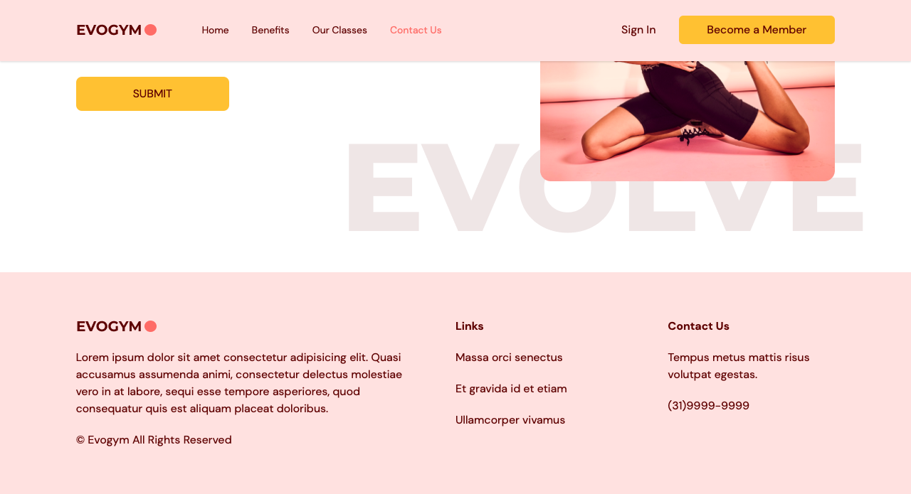

# REACT TYPESCRIPT TAILWIND GYM SITE PROJECT

This is a fully responsive website I made using React for an imaginary Gym Franchise. 

## Table of contents

- [Overview](#overview)
  - [Screenshots](#screenshot)
  - [The challenge](#the-challenge)
  - [Deploy](#deploy)
  - [My process](#my-process)
  - [Built with](#built-with)
  - [What I learned](#what-i-learned)
  - [Continued development](#continued-development)
  - [Useful resources](#useful-resources)
- [Author](#author)
- [Acknowledgments](#acknowledgments)

## Overview

This is my first project using TypeScript, and Tailwind. I've had experience using HTML and CSS, and React before, but this is my first time working with these new technologies.

### Screenshots

Navbar and Home Sections

Benefits Section

Benefits 2nd part

Our Classes Section

Join Now Section

Footer Section

### Deploy

[https://real-sate-react.vercel.app](https://react-typescript-gymhomepage.vercel.app/)

### The challenge

Here are some of the challenges I faced during the project:

### 1. Learning a new language
TypeScript was completely new to me, and it took some time to get used to the syntax and type annotations. I had to read the documentation and watch some tutorial videos to understand how to work with it.

### 2. Managing state
Working with React's state management system was a bit of a challenge for me. It took some time to get used to the concept of lifting state up and passing props down.

### 3. Learning a new framework
Tailwind is a new CSS framework for me. It was quite different from other CSS frameworks I've used before, and it took some time to understand how to use the utility classes effectively.

### 4. Debugging errors
As with any new technology, I encountered some errors while working on this project. Debugging these errors took some time and required me to read documentation and look for solutions online.

## My process

Despite the challenges, I'm happy to have completed my first project using React, TypeScript, and Tailwind. I learned a lot during the process and look forward to using these technologies in future projects.

### Built with

### What I learned

Improved my skills working with React, and new frameworks.

### Continued development

I now look forward improving my React, Typescript and Tailwind Skills

### Useful-resources

React: https://reactjs.org/
Typescript: https://www.typescriptlang.org/
Typescript Types vs Interfaces: https://www.typescriptlang.org
Vite: https://tailwindcss.com/docs/guides/vite
Google Fonts: https://fonts.google.com/
Tailwind: https://tailwindcss.com/
Prettier Tailwind Css Plugin: https://github.com/tailwindlabs/prettier-plugin-tailwindcss
Prettier Tailwind Css Sorting: https://tailwindcss.com/blog/automatic-class-sorting-with-prettier#how-classes-are-sorted
Hero Icons: https://heroicons.com/
Framer Motion: https://www.framer.com/motion/introduction/
Form Submit: https://formsubmit.co/
React Anchor Link smooth Scroll: https://github.com/mauricevancooten/react-anchor-link-smooth-scroll

## Author

Eduardo Vinagre (@eduvinagre)

## Acknowledgments

